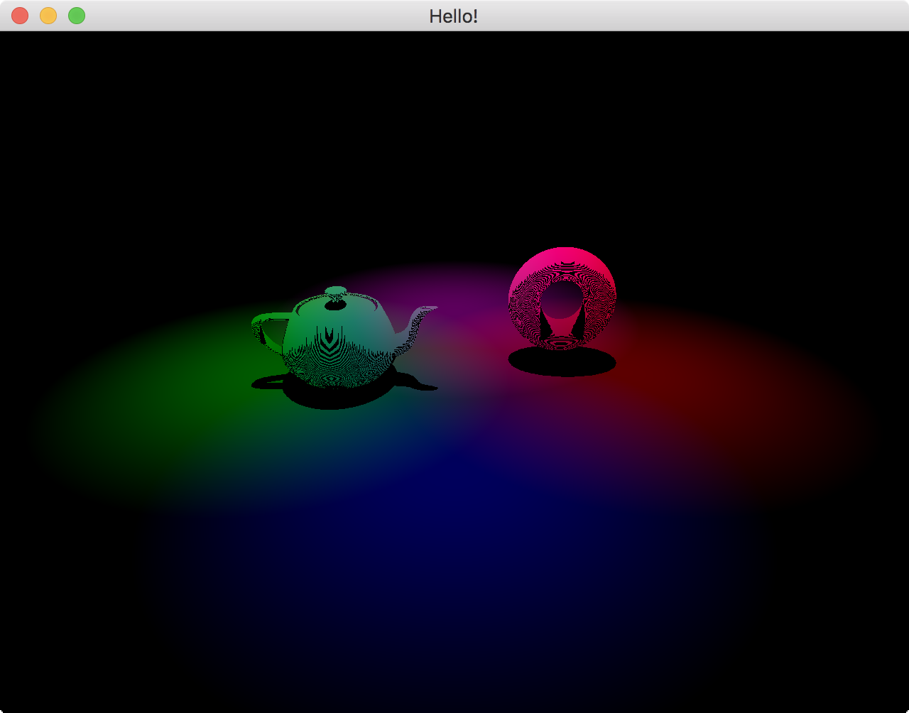
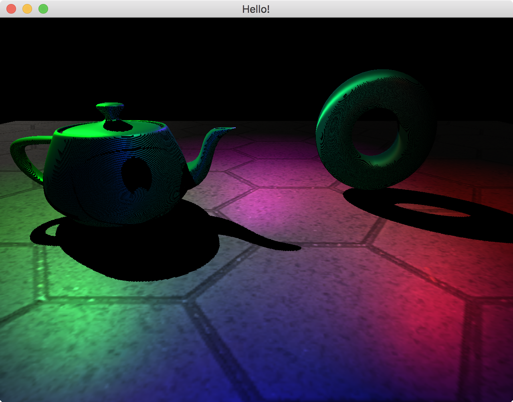

# GAME

## intro

ゲーム業界への転職を考えて、ゲームをつくってみることにした。
windowsで自由に開発ができる環境が今ないのでひとまずmacをつかってXCodeで開発をすすめる。

C++もopenFrameworksを少し触ったことがあるくらい、
Unityなしのゲームプログラミングは初めてだが2/2までに形にすることを目標にがんばる。

今日が12/6なので2ヶ月ないくらいか。

## 記録

このまま作品として提出したいし、自分の強みは自力で調べて
情報を集めながら身につけつつ、作っていけることかなと思い、
どの時期に何を考えていたか記録をつけることにした。

### 12/6

c++でゲームを作るときの標準構成？みたいなのを調べ、
GLFWでウインドウを出すところまで、やった。
GLFW3.2.1を使っていたが、実行時エラーがでて少しハマった。
3.3にバージョン上げればいいみたいな感じで書いてたのでそうした。

そのあとは、市場調査をした。
githubで適当な検索ワードでシンプルめなゲームのリポジトリを何個かみた。
次は、meshをつくって、それにshaderをあてるmeshの位置が動くところまでを目標にする。
※なんとなく、window部分だけclass分けたり、、みたいなリファクタリングをしたくなるだろうが我慢する。とりあえず書くことを目標に。

### 12/9

インターネットで情報を拾ってシェーダーを使って三角形をつくった。
ほとんどコピペしながら模写した。1ファイルにまとまっているので
ちょっとだけわけたい。移動とか回転ってどうするんだろ...

軽く調べ始めたら、今までの復習になりそう+もう少し踏み込んだ？ことが
超丁寧に書いてあるpdfを発見した。
http://marina.sys.wakayama-u.ac.jp/~tokoi/GLFW.pdf
ので移動中とかに読んでおく。
glewも使ったほうがいいのかな。手元にある本(https://www.borndigital.co.jp/book/2020.html)
もつかってるし。

### 12/13

シェーダーのコンパイルまわりがなんとなく落ち着きそうな雰囲気を
見せてきた。が、今日は時間が限界
3日に1回数時間しか作業できてなくて焦るーー

### 12/12

シェーダーのコンパイルらへんでつまる。
どうやら色んな方法があるみたい、とファイルをわけるのもなかなかうまくいかない

### 12/16

やっとシェーダーのファイルを分けてコンパイルして使うことができた。
Xcodeでfstreamでファイル読めないのに地味に手間取ったりした。
(edit schemeでプロジェクトパス指定してなかったから相対パスで読み込めてなかった)

でもいろんなコード比較しながらコードを読んだので詳細が理解できた、気がする。

ここまでつくってみて、VBOメッシュとシェーダーの関連付け?ってどうなってんだ
と思って調べたらどうやらgl_UserProgramとgl_UserProgram(0)の間に描画を挟むと
そのシェーダーが使われるようだ。
見ていたサンプルはmain()に一括で処理して終了もなかったので気になって調べてみた。

次は現状mainに全部書いてるやつを分けてmeshクラスを作成し移動や回転をさせるところを目指す。

### 12/19

前回に続き、meshをわけたり、移動、回転をやろうとしていろいろハマっていた。
まず、glpushmatirxとglpopmatrixとgltranslateてきなやつは全部非推奨になっているらしい。
それとどうやら自分で書いた  `glfwWindowHint(GLFW_OPENGL_FORWARD_COMPAT, true);`は非推奨のものを
使えなくするやつらしい。。ということに気がつくまでにかなり時間を食ってしまった。
openGLが昔からあるのでしばしば古い資料があるので見分けがつかない、、本読めってことかな？
てことは、移動回転は全部positionをuniformで送ってvertex shaderで処理するのかなぁ。。

あとこれは解決していないのだけれど、glviewportでviewport設定すると
viewportがずれて最初出てくる。そしてウインドウを動かすと正常になる
そしてウインドウをリサイズするとまた狂う。
原因わかんないけど闇が深そうなのでとりあえずおいておこうかなと思う。

### 1/7

年末年始仕事のピークがやってきてこっちの勉強をする余裕がなかったという言い訳から2018年を始めます。
迷ったら見る行列関連の資料 http://www.opengl-tutorial.org/jp/beginners-tutorials/tutorial-3-matrices/
glmについてまとまってるやつ https://qiita.com/usagi/items/f34976a3d3011506ff7d
(後日記入)
この日までにplaneを回転させることができた。フレームワークとかゲームエンジンを使う時に
たまに出てくるワードprojectionMatrixとかviewMatrixとかの意味が少しわかった気がする。
threejsでカメラクラスのコンストラクタの引数にperspectiveとか持つけどその中身でこんなことが
おきてそうだなーっていう気づきがあったりして楽しい。
インターネットの記事を漁った感じ今のところ体系的にまとまっているのが
http://marina.sys.wakayama-u.ac.jp/~tokoi/GLFWdraft.pdf
なのでこちらを軸に進める方針にした。丁寧にまとまっており非常にわかりやすい。
現在進行形で続きが書き足されていっているっぽい(現時点で260ページ)
現状のコードはこの資料のコード+シェーダーコンパイル周りは確か別のやつ参考に、+行列計算まわりはglmで手抜き
という感じになっている。

### 1/10

ひとまずhttp://marina.sys.wakayama-u.ac.jp/~tokoi/GLFWdraft.pdf
の第8章形状の表現にあたるところまで進んだ。
頂点インデックスの順番がなんちゃらとかそういうのは何回かやったことあるので
すらすらこなした。attributeのlocationの設定をシェーダーのlink前にやってた部分は
openglのバージョンを上げればshaderのlayoutで設定できるらしいのでそっちですることにした。
現状で最後の章、第9章の陰影付けはメインの軸をこっちの本(https://www.borndigital.co.jp/book/2020.html)に
移したいと思う。なぜなら半年くらい前にopenFrameworks+glslの構成でこの本を途中まで読んでいるから。
ついに3D感がでてきて楽しくなってきた。
C++がわからないというフェーズにも差し掛かってきた気がする。

chrome閉じちゃうのでブクマ(http://miffysora.wikidot.com/opengl-deprecated)

### 1/11

`glBindBuffer(GL_ELEMENT_ARRAY_BUFFER, ~~);`でGL_ELEMENT_ARRAY_BUFFERをbindして
別のクラスでもbindするとそっちが上書きされるっぽい挙動に引っかった。
そもそもrender時にbind/unbindして使うものなんだろうか、
それより先にトーラスクラス作ったけどそれもうまく表示できないから
トーラスを表示させてから複数オブジェクトの表示にチャレンジしたいと思う。
トーラスをphongシェーディング？するところまでできた。当たり前だけど急に3Dぽくなって
テンション上がった。glBindBufferらへんをこれから調査していく。

### 1/12
機能のglBindBufferの件は
今まで書いていたコードはglBIndVertexArrayしてから、なにもしてなかった。
glBindVertexArray(0)で終了？を明示的にしないといけないらしく、
そうしないがために違うオブジェクトでVAOつくる時に影響がでていたっぽいという
ところで解決しましたー　

### 1/15
こないだ何故かトーラスを回転させると
キューブのライティングが変になるという現象があり、それの解明に引っかかっていたのだけれど
normalのuniformを送り忘れていてtorusのものが使用されちゃってたからみたいな凡ミスだった。。つらい。

### 1/16
次はテクスチャとノーマルマップと思い、昨日の続きから。
昨日はテクスチャのロードにgliを使って1枚だけロードするところまでやっていた。
かんたんに導入できそうな画像読み込みのライブラリがgliだったのでddsをフォトショップで
編集にできるようにしたり、みたいなので時間もかかった。
あとはテクスチャを複数枚使うときの設定？TEXTURE0みたいなのも少し、、

そのあとnormalマップ貼ろうとしたら、どうやら接ベクトルというものが必要らしいと。
接ベクトルとは何か、計算方法(texcoordとか使うやつ)を調べて実装するところまでおわた。
(これでできているかは謎)
不安なので、本についてるモデルで試そうと思う＝objをロードするvboメッシュが必要になるので
明日はその辺から進めようと思う

### 1/24
objをロードしてnormal貼るやつをやった。
texcoordのyが逆になってて？ずれてたのには少しはまった。
あとやっぱりtextureのbind周りは少し不安かな。。
フレームバッファオブジェクト使ってレンダーテクスチャを貼ってゴニョゴニョするのもやったんだけれど
レンダーテクスチャとモデルのテクスチャが混じってよくわからなくなったので
少しコード量も増えてきたし一度整理するためにまたテクスチャを貼ってない
トーラスを描画して、レンダーテクスチャにするところまでをシンプルにやった。

### 1/25
main()にいろいろ詰め込みすぎて、整理しきれなくなってきたのと、
コピペミスみたいなのでハマることが多くなってきているので
一旦整理するために自分なりにmeshクラス、materialクラスなるものを作成した。
c++の知らない部分でちょくちょく詰まる。。

### 1/26
ついに遅延シェーディングっぽいものができた。(気がする)
影のおちかたがなにか変な気もするんだけれどfragmentのアンビエントをなくしたからかもしれない。
そして早速昨日作ったmesh, materialクラスに不都合が生じてしまいかなりぐちゃぐちゃになってしまった。
deferredやってみていくつかどうしようみたいなことが生じた。
まず、ひまわりの本ではpass1, pass2をサブルーチンでやっているが実際のところの開発でも
そうしてしまうとすべてのmeshを全部同じマテリアルを使用して描画しないといけないのでは？
ということである。pass1とpass2でシェーダーファイルを分けるってこと？
同じようなことで、例えばunityとかは当然複数モデルがあったらそれぞれ違うマテリアルを持っていて
カメラの設定をdeferredにすれば(おそらく)全部の情報がgバッファに書き込まれて最後にレンダリングを
しているのだろうがその最後にどのピクセルをどの光の計算式で計算すればいいかわからないような気がするんだけれど
それもどうやっているのだろうなーー。。(うまく言語化するのが難しくて伝わらないかも)
分かれているけど内部的にはすべて1つのシェーダーprogramで、gバッファ書き込みの際に
どのマテリアルがあったってるかテクスチャみたいなのも保持しておくとかしか思いつかない。

そして、この勉強果たして意味のあるものなのだろうかという不安が急にきた。どうしよう。

 
 

### 1/29
deferred shadingについていろいろ考えたことメモ。
http://download.nvidia.com/developer/presentations/2004/6800_Leagues/6800_Leagues_Deferred_Shading.pdf
9ページ目 Attributes neededのothersにmaterial IDとあるので、
シェーディングの分け方は評価するピクセルのマテリアルidをfboに格納して2パス目で振り分ける方式の
ような気がしてきた。
以下あとで読もうと思うdeferred shadingについて言及している記事。
週末に新宿のでかい本屋に行ったがこのあたりの知識についてnext stepに良さそうな本がなかった
gpu gem3は迫力あったけどもう少し鍛錬しないと理解出来なさそうな感じがした。

[tutorial]
http://www.sccg.sk/ferko/dpMichalFerko2012.pdf
http://ogldev.atspace.co.uk/index.html
https://research.ncl.ac.uk/game/mastersdegree/graphicsforgames/
http://www.csc.kth.se/utbildning/kth/kurser/DD143X/dkand12/Group1Marten/final/final_TransparencyWithDeferredShading.pdf
[memo]
http://d.hatena.ne.jp/tueda_wolf/20110916/p1

このあたりは深掘りしていると時間かかりそうなので一旦影を落とそうと思う

### 2/2
影が落ちた。(やっと)
まだハードシャドウなのでいい感じにソフトシャドウまでこの本を読み続けようと思う。
リアルタイムレンダリングの基本編でやっておくべき内容としては
とりあえずこれらを組み合わせて自分なりの実装に落とし込むことと
SSAO, HDR, ブルーム, ジオメトリシェーダーあたりかなぁ
いやまだ、リアルタイムリフレクション的なとか、被写界深度とか
ポストエフェクト周りはいろいろあるかー。あとdeferredでやるならアンチエイリアスも
本来は2/2までにゲームを作る予定だったが余裕でこしてしまった。
まぁ急がず自分のスピードでやっていこうと思う。
というか2ヶ月で進捗これだけってどうなんだろう。。

### 2/8
メモを書くことをすっかり忘れていたがここ最近はshadowmapとdeferredをあわせたレンダリングを
つくっていて、何回か詰まった。覚えているので言うとfboの理解があんまりで
fragment shaderのout (laoyout = 0)0とか1とかの数字とテクスチャの対応がよくわからん問題で
gldrawbuffersに入れる配列の設定とglFramebufferTexture2Dで対応付けをしているみたいなのとか
んでやっとできたところで、スクリプトがごちゃついてきたので整理するために現状の最適だと思う
クラス設計をしたり、今まではサブルーチンとか使って2passでやるみたいな感じで本のサンプル通りやってたが
lightdepthみる、シャドウマップ生成,g-buffer作成, shadingの4passになって流石に1つのシェーダーに書くのつらかったので
一旦上記の4パスにシェーダーを分けてrenderpassクラスをつくって何度もシーンの描画とかしなくていいような感じにした。
ついでに今まで同じ値を使うという決まりでシェーダーのところにライトの位置とかviewmatrix等々を書いていたのを
Lightクラス、cameraクラスをつくったりして分離した。
meshのクラスも基底クラスをつくりシーンクラスからlight、camera、meshesをシェーダクラスに入れて
各パスで必要に応じてlight, camera, meshesを使うみたいな感じになりました。
多分伝わらないだろうが・・・
fboの扱いがちょっとまだよくわからずシーンクラスにべた書きしてある。。
とりあえず思考とスクリプトがなんとなく整理されたので次のステップにいこうとおもう。
deferredでテクスチャを貼ったメッシュを出してないのでそれをやるのと
実はzを評価してなくて書いた順にオブジェクトが重なっちゃってるので定石(ってどこかのサイトに書いてあった)っぽく
深度バッファをするパスを追加するなどしてそれをもとにg-buffer生成する感じにしたいと思う。

 

### 4/4
しらばらく仕事が立て込んでいてまったくこれに手を付けれていなかった。
いつの間にか2ヶ月が立っており、自分が一体何をしたかったのかも忘れていてたので
いったん読み直した。こういう時に前回までのメモを取っていたのはかなりありがたかった。
それで思い出したのが、多分次にやろうとしたことはオブジェクトごとに違うテクスチャとか色とか
設定するということだった気がする。
というわけで今はシェーディング関連のuniformのセットをRenderPassというクラスでいたが
meshにrenderPassの参照を渡してそれぞれでuniformをセットしようという方針に変更しようと
移動作業を行った。

### 4/5
昨日の作業で各MeshクラスにRenderPassクラスを渡してMeshクラス自身がレンダリングの処理を行う仕様になったので
こんどはMeshクラスにMeshMaterialクラス(new)のメンバ変数を追加してこいつがtextureとかなんやらのuniformを
セットする方針。Meshクラスに渡されたRenderPassをそのままMeshMaterialにもわたしてsetUniformする。
ひとまずtextureをセットするTextureMeshMaterialというクラスをつくってPlane, Torusにそれぞれ設定したところ
ちゃんと別々のテクスチャが描画されたので成功したっぽい。

 

### 4/7
z位置の評価がされてなく、オブジェクト描画順を変えると前後関係が変になる件について向き合った。
単に、`glEnable(DEPTH_TEST)`を忘れていただけだった。。
のはすぐに解決したんだけれど、どうやらシャドウマップも変になってしまうことがわかり
そこに若干はまった。いろいろ検証していたら単にシャドウマップパスで出した絵は正常にでてるのに
fboに書き込まれた絵は正常ではないということがわかり、fboあたり見直していたところ、
`glFramebufferRenderbuffer(GL_FRAMEBUFFER, GL_DEPTH_ATTACHMENT, GL_RENDERBUFFER, shadowDepthBuf);`
これやらないとfboのdepthが有効にならないっぽい。本が手元にないので後で調べる。

### 4/30
完全に計画性とか継続性がなくなってきた。もしくは書いてないだけかな？
とりあえず簡易的にdeferred shadingとshadowmapでシーンがつくれていたので
次はシェーディングを整えることにした。ということで物理ベースレンダリングの実装に手をかけ始めた。
本当は全体のリファクタリングするか迷ったがどうせまた不都合な部分でてくるしホントの最後に気力があれば
やればいいかみたいな感じになっている。
物理ベースレンダリングについてはこの記事(https://qiita.com/mebiusbox2/items/8a4734ab5b0854528789)
がすごく勉強になりそうなのでthreejs環境もつくって比較しながら進めていくことにする。
この記事はfowardなのでdefferd用の調整を行った。
normalとpositionはgbufferで取ってきているのでそれを使う。metallicとroughnessは
この記事(https://www.hiagodesena.com/pbr-deferred-renderer.html)ではnormal, colorのa値にそれぞれ入れていたので
そうした。それに伴い若干つまづいたのはalphaを使うにはglEnable(GL_BLEND)とかそういうことをしてアルファを
有効にしないといけないと勘違いして(事実、gbuffer passでfboに入れずにそのまま出したら有効にしないと実行結果にalpha値反映されなかったので)
はまった。どうもfbo textureのrgbaの値がおかしい。。結果そういうのいらないらしくそのまま素直にやったらできた。
あ、textureのフォーマットがRGBだったのでその2つはRGBAにしました。
これで準備は整ったはず。。

あと今影にモアレみたいなのがうつっていてこれは物理ベースレンダリングが終わったあと対応する予定。
どうやらシャドウアクネという現象らしい(めも)(https://msdn.microsoft.com/ja-jp/library/ee416324(v=vs.85).aspx)

 

### 5/13
作業した日に書くというよりも、時々気がついた時に書くみたいな感じになっているが久しぶりに真面目に向き合っている。

前回から引き続き物理ベースレンダリング(以下pbr)を実現しようとしている。シェーダーの実装は前回取り上げたwebGLの
記事を移せば終わってしまうのだがここは一度真面目に理解しようと解説編をしばらく眺めていた(https://qiita.com/mebiusbox2/items/e7063c5dfe1424e0d01a)
何回読んでも頭に入ってこないのでここ1週間くらいほぼ毎日読んで他のサイトとかwikipediaみたりしていたらなんとなく頭に入ってきた。
なので実装上はそのままつかうかたちに。

読んでる途中にあまりにもわからなくてレイトレ向けにpbrを解説してるページもあったので
前々から気になってた「はじめようレイトレーシング(http://raytracing.xyz/)」をやったがここではpbrとかレンダリング方程式とか
放射輝度みたいな話までつっこんでいなかった。しかし少し3Dの描画について詳しくなった気がする。

というわけでシェーダーはできあがったが、c++の方の実装がぐちゃっていたりLightのクラスとかほとんどつくってないので
今はc++側の調整を地道にやっている。その途中で複数光源のときのシャドウマップってどうすればいいの問題に気が付き
なぜかしばらくまた影周りの調査に時間を使っていた。結果、なんか大変そうなので一回置いておくことにした。
関係あるかわからないが最近の影事象に関していい感じにまとまっていたスライドみつけたのでメモ(https://www.slideshare.net/ProjectAsura/ss-66370182)
とりあえず今は影をつくるlightは１つのみの実装にしてある。point lightの影もまたちょっと違う実装が必要そうなのだが
それもいったん無視してdirectioal, spotのどちらかしか使わないという暗黙のルールで乗り切ることにする。
point lightの影のチュートリアルメモ(https://learnopengl.com/Advanced-Lighting/Shadows/Point-Shadows)

んで今はlightのクラスをつくったのでuniformの受け渡し部分書いている途中。

### 5/14
lightクラスひとまず実装できた。c++、文字列をいい感じにformatするクラスが標準でなさそうだったので
(jsでいうところの`DirectLight[${index}].color`みたいな感じでuniform渡したかった)
ついに全部のピースがそろった！実行した！わーい真っ黒！
明日から地道に原因探っていく。。

### 5/15
原因を探した結果、まず単純にuniformの名前間違えてたのとsetUniformっていうoverloadの関数をrenderpassに
用意してたんだけどintを渡すやつ実装してなくてとかライトの向きが入る方向になってたとかいろいろだった。
それでもまだポイントライトとスポットライトは真っ黒のまま。
ひとまずディレクショナルライトだけでデバッグしていてなんか見た目がおかしな原因を探っていたら
ライトの方向ワールド空間の値渡してたけどこれ多分カメラ空間にしないといけないやつなきがする。
サクッと実装できるほどまだ行列計算に明るくないし夜は更けているので明日以降におあずけしたいと思う。

### 5/22
ついにディレクショナル/ポイント/スポットライトそれぞれで物理ベースレンダリングが正しく描画されている
感じの絵を得ることができた。結構時間かかってしまったー。
今後の展開としてはIBL、GI、影、各種ポストエフェクトかなあ。
影>IBL>ポストエフェクト>GIくらいの優先度でやっていこうと思いつつしばらく違うこともやりたいなと。

 
 

### 6/17
6月某日、appleでこれからOpenGLを非推奨にしていくという発表があった・・・
学習を通して3Dグラフィックスの基礎的な概念などを学ぶことができたので
勉強していた意味がなくなったとは言えないが、これからこの環境で続けていくのは
未来がなさそうなのである程度きりもいい？のでこのプロジェクトは一度ここで閉めようと思う。
当初2ヶ月でゲームつくるとかなんとか言っていたが半年たった今でまだ描画の仕組みをつくっただけという
ことになる。全然有言実行ができていない。
この環境でのグラフィックスの学習は一度やめにするが最終目標は転職であり、
もともとは提出用？のゲームをつくるのが目的なのでこの自前エンジンでc++でゲームを作っていこうかと思う。
使ってないソースコードを整理してプロジェクトを別にする。

### 6/25
windowsのマシンを買ったので一旦開発環境ごと移したい。
届くまで時間があるのでそれまではmacでゲーム開発環境的なプログラムを作っている。
UnityのMonobehaviourみたく、すべての3D関連クラスは基底クラスにObject3Dクラスを持ち、
Object3Dにbehaviourスクリプトをつけて動作するみたいなことできないかなと思って試してみた。
位置とか回転の操作をしたいのでbehaviourスクリプトもObject3Dを基底クラスに持ちたくて
transform,scale,rotationのmatrixをポインタ変数にしてaddBehaviourしたときに親のポインタを参照？
する形にしたんだけれどc++的にこれはアリなのか不安。一応検証っぽいコードは書いてみたけど。。
あ、あとgetPositionとかをする際に毎回行列からvec3とかに変換しているけどここ毎フレーム取ると
ボトルネックにならないか心配だけどまぁひとまずは楽な方法で。
次はObject3Dの親子関係かなぁ

### 6/26
親子関係をつくって描画するところまではできた。
updateはObject3D内で再帰させて更新していくけどdraw()はRenderPassクラスから読んで再帰みたいな
これでいいのかな。。というつくり。不安だ。pass毎になにを描画するかかわるので(defferredパスとか
平面だし)drawはRenderPassに書くしかないよなぁ〜の苦肉の策である。
あとは位置スケール回転周り。
ローカル座標とワールド座標のあれこれがややこしくもう少し時間かかりそう
メンバ変数で持っておくのはローカルのt, s, r行列でいいのか？でも描画時はワールド空間の行列を
渡さないといけないから、とりあえず子に親の行列をupdate時に渡していけばよさそう？
あれでもなんか変＝なにかわすれてるんだろうなーということで頭の整理が必要。

### 7/1
ちょっとというよりもかなり時間をかけてしまったように感じるのだが一応unityでいうところのtransform周りの
機能が完成した。現状Object3Dクラスにまとめてしまっているが機能が増えたらunityみたくtransformクラス
にしようと思う。配列をかける順番とか、ちゃんと意図通りに動くかどうかという部分で
検証やデバッグの時間をとられてしまった。だし思いのほかテンションがのらずにだらだら作業してしまった。
まぁ一応根幹の部分なのでバグのないように、後々変更しなくていいように、、という気持ちはあったが。

### 7/9
behaviourスクリプトをnewしてObject3Dにaddする仕様になっていたのだが外でnewすると
メモリ管理的な視点？で危ないような気がしたので(テキストでうまく説明できないが
newしたbehaviourに消した後もアクセスできちゃうような)、stringからクラス生成できる
ファクトリメソッドをもたせて、(参考: https://stackoverflow.com/questions/1832003/instantiating-classes-by-name-with-factory-pattern)
よりunityのaddCompoent<T>っぽい書き方になるようにした。

### 7/11
シーンクラスをつくってオブジェクト等の管理とかはそっちに任せることにした。
AppBaseを起点にいろいろnewしてsceneにaddしてrendererにsceneを渡す。
rendererはsceneをレンダリングする。
three.jsのような方向性になってきたような気がする。
ずっと目を背けていたのだがdeleteしたときのメモリ周りを一切確認していないので
それさえちゃんとすれば、一旦はゲーム制作の方に移れるのかなぁと思う。

### 10/6
なんと3ヶ月もの時間があいてしまった、。このメモによると6/25あたりにwindowsのPCを購入したらしい
届いたのはその2週間後なのかな。おそらくその後の作業と並行しながらwindowsでも動くか試していて
もちろんそのまま動くなんてことはなく最初はエラー出まくってて動かなかったのをとりあえずエラー
をなくすところまでは7月に作業してあったと思う。そろあと真っ白な画面しか映らずしばらく向き合えずに
いたが最近またやり始めて今日ついにもとの絵がでた。めでたい！！
原因を出してみると`glm::mat4()`を`glm::mat4(1)`にしないとだめだったり(なぜかmacでは動いていたんだ)
viewportまわりがmacのretinaディスプレイのままだったり、まぁそのほか小さいことが積み重なって
真っ白になってしまっていた。コードが大きくなりすぎていて、これらの原因を追求するのにも
小さく切りとって部分的にチェックしたりしていたので恐ろしく疲れる作業だった。
プログラム的には何も進捗がないのにえらく時間を使ってしまった。
とりあえず次は影が汚いのを何とかする。

### 10/17
ここ数日間で影が幾分改善された。やったこととしてはopenglのチュートリアルのサイト
(http://www.opengl-tutorial.org/jp/intermediate-tutorials/tutorial-16-shadow-mapping/)を
みながらアクネとピーターパンを改善して、ひまわりのopengl本の方のランダムサンプリングによる
ソフトシャドウのセクションの実装を移植した。前まで汚かった部分がきれいになり満足である。
次はポストエフェクトかなぁ。アンチエイリアスはかけたい。
あと少しリファクタなり実装が中途半端なところを実装し直さないといけないような気もしている。

### 10/28
ポストプロセスのシステム部分つくった。renderpass/postprocessPassでシェーダーを指定してつかう
マルチパス必要な処理もあるのかなと思ってpassの数も指定できるようにしてその数に必要な分だけfboつくって
for文でまわしながらシェーダーのサブルーチン使って使うpassを指定するみたいな？(伝わってほしい)
感じにした。これを書きながら思うところ、1passで複数テクスチャ出したい場合(マルチレンダーターゲットだっけ？)
このシステムだとできない気がする。。その時考えよう。
でも今結局クラスにシェーダーが紐付いているし内部処理もそのシェーダーに合わせてハードコーディングするのでも
いいかもしれない(この時点のRenderer01.cppとかがそうなってるように)
逆にいうとそれが解決するならRendererクラスも今みたいなハードコーディングやめてある程度柔軟にパスを定義して
forでまわすだけみたいな感じにしたい(伝わってほしい)
ところでシェーダーってincludeとかrequireみたいなのないのだろうか。UnityのshaderLab(hlsl)にはあるよね。
軽く調べて見た感じ簡単にはなさそうだったのでしばらく放置する。

 

### 1/6
数ヶ月に1度しかやらないみたいなルーティーンができてしてしまった。
とりあえず前回までの部分にポストプロセスのシステム部分作ったと書いてあるが動かなかったので直した。
しばらくの期間やめるならちゃんと動く状態にしてから休止してほしい。自分。

さて、このプロジェクトも最初は2ヶ月とか思っていたのになぜか1年以上も続けている。
ひとまずこのメモも当時のスクショを足したりしてまとめる。
gitignoreしてプロジェクトに含んでいたがgithubのマークダウン改行とかが見づらい印象にあるので
drop box paperにまるっと移そうかな。

